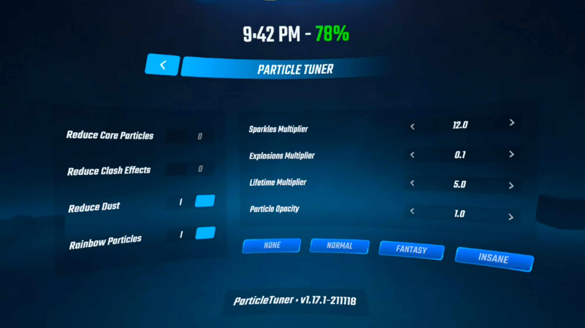

Quest ParticleTuner
===================

A partial port of the [ParticleOverdrive mod](https://github.com/Shadnix-was-taken/BeatSaber-ParticleOverdrive/commit/68f8eeb9100a88606faabdd875520654993fbcbc) from PC. Coded by [Marcus Zhou](https://github.com/SuperMarcus) for Beat Saber v1.16.4 and updated to BSQ 1.17.1 by [Mioki](https://github.com/okibcn) with fixed rainbow particles and speed optimizations.

## Features

* De/Activate Core particles
* De/Activate Clash effects
* De/Activate ambiend dust
* De/Activate Rainbow sparkles

* customizable amount of sparkles
* customizable amount of explosion particles
* customizable lengh of effects explosions and sparkles
* customizable transparency of explosions and sparkles

## Settings

The preferred way is to use the in-game UI for configuration.

## Credits

* ParticleOverdrive: [Shadnix-was-taken/BeatSaber-ParticleOverdrive](https://github.com/Shadnix-was-taken/BeatSaber-ParticleOverdrive) and [lolPants/BeatSaber-ParticleOverdrive](https://github.com/lolPants/BeatSaber-ParticleOverdrive)
* Libraries: [QuestUI](https://github.com/darknight1050/questui), [beatsaber-hook](https://github.com/sc2ad/beatsaber-hook), [codegen](https://github.com/sc2ad/BeatSaber-Quest-Codegen), [custom-types](https://github.com/sc2ad/Il2CppQuestTypePatching)
